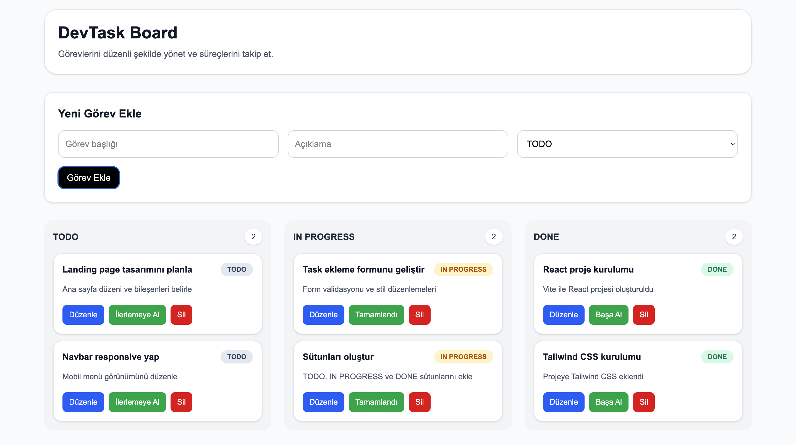

# DevTask Board

DevTask Board is a Kanban-style task management application developed with React, Vite, and Tailwind CSS.

## Features

- Add new tasks
- List tasks by status
- Edit tasks
- Delete tasks
- Change task status
- Save tasks with localStorage

## Technologies

- React
- Vite
- Tailwind CSS

## Project Structure

- components
- pages
- interfaces

## Screenshot

## Live Demo

devtask-board.netlify.app

## GitHub Repository

https://github.com/betlllgemi/devtask-board
